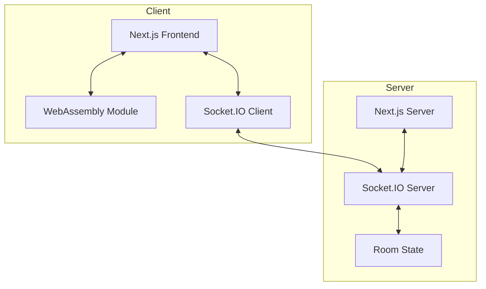
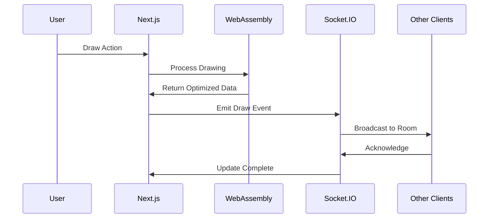
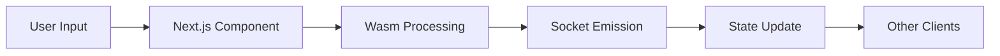
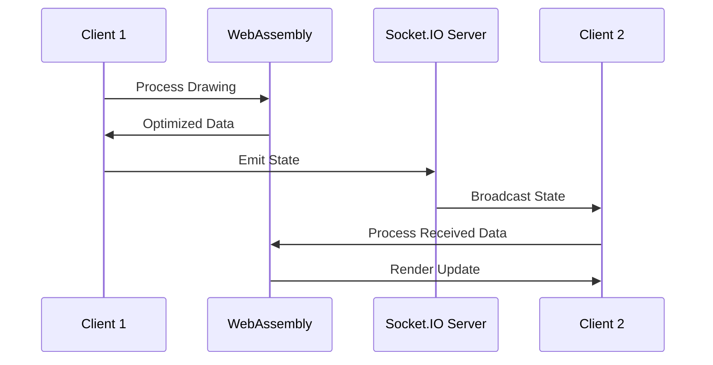
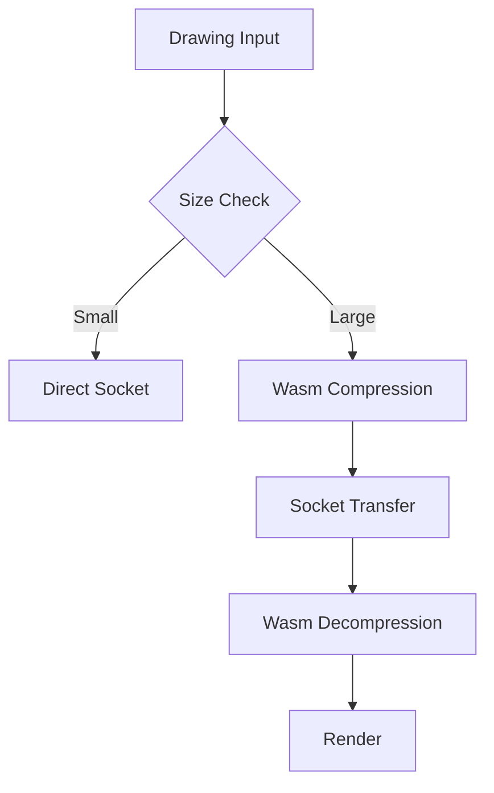

# Full Stack Integration Guide

This document explains how Socket.IO, WebAssembly, and Next.js work together in the Collaborative Whiteboard application.

## Architecture Overview



## Component Interaction Flow



## Data Flow Architecture

```
┌─────────────────────────────────────────────────────────┐
│                     Client Browser                      │
├─────────────┬─────────────────────────┬────────────────┤
│  Next.js    │      WebAssembly        │   Socket.IO    │
│  Frontend   │    Drawing Engine       │    Client      │
├─────────────┴─────────────────────────┴────────────────┤
│                     WebSocket Connection                │
├─────────────────────────────────────────────────────────┤
│                      Next.js Server                     │
├─────────────┬─────────────────────────┬────────────────┤
│   API       │        Socket.IO        │    State       │
│  Routes     │         Server          │   Management   │
└─────────────┴─────────────────────────┴────────────────┘
```

## Integration Points

### 1. Drawing Pipeline



#### Implementation
```typescript
// Whiteboard.tsx
export default function Whiteboard() {
    const wasmEngine = useWasmEngine();
    const socketClient = useSocketClient();

    const handleDraw = async (event: DrawEvent) => {
        // 1. Process with WebAssembly
        const optimizedPath = await wasmEngine.processPath(event.path);
        
        // 2. Update local canvas
        drawToCanvas(optimizedPath);
        
        // 3. Emit to other clients
        socketClient.emit('draw', {
            path: optimizedPath,
            roomId: currentRoom
        });
    };
}
```

### 2. State Synchronization



#### Implementation
```typescript
// state-sync.ts
class StateManager {
    constructor(
        private wasmEngine: WasmEngine,
        private socketClient: SocketClient
    ) {
        this.setupSync();
    }

    private setupSync() {
        this.socketClient.on('state-update', async (state) => {
            const processed = await this.wasmEngine.processState(state);
            this.updateLocalState(processed);
        });
    }
}
```

### 3. Performance Optimization



#### Implementation
```typescript
// optimization.ts
async function optimizeDataTransfer(data: DrawingData) {
    if (data.size < THRESHOLD) {
        return data;
    }

    // Use WebAssembly for large data processing
    const compressed = await wasmEngine.compress(data);
    return compressed;
}
```

## Technical Details

### 1. WebAssembly Module Loading

```typescript
// wasm-loader.ts
export async function initializeWasm() {
    try {
        const wasmModule = await import('@/wasm/drawing.wasm');
        await wasmModule.initialize();
        
        // Setup Socket.IO integration
        socketClient.on('draw', async (data) => {
            const processed = await wasmModule.processDrawing(data);
            updateCanvas(processed);
        });
        
        return wasmModule;
    } catch (error) {
        console.error('Wasm initialization failed:', error);
        throw error;
    }
}
```

### 2. Socket.IO Room Management

```typescript
// room-manager.ts
export class RoomManager {
    constructor(
        private wasmEngine: WasmEngine,
        private socketServer: SocketServer
    ) {
        this.setupRoomHandlers();
    }

    private setupRoomHandlers() {
        this.socketServer.on('connection', (socket) => {
            socket.on('join-room', async (roomId) => {
                // Get room state
                const state = this.getRoomState(roomId);
                
                // Process with WebAssembly
                const optimizedState = await this.wasmEngine.processState(state);
                
                // Send to new user
                socket.emit('room-state', optimizedState);
            });
        });
    }
}
```

### 3. Next.js API Integration

```typescript
// pages/api/room/[id].ts
export default async function handler(req: NextApiRequest, res: NextApiResponse) {
    const { id } = req.query;
    const wasmEngine = await initializeWasm();
    const socketServer = getSocketServer();

    // Handle room state
    const state = await getRoomState(id);
    const optimizedState = await wasmEngine.processState(state);

    // Update connected clients
    socketServer.to(id).emit('state-update', optimizedState);

    res.json({ success: true });
}
```

## Performance Considerations

### 1. Memory Management
```typescript
// memory-manager.ts
class MemoryManager {
    private wasmMemory: WebAssembly.Memory;
    private sharedBuffer: SharedArrayBuffer;

    constructor() {
        this.wasmMemory = new WebAssembly.Memory({
            initial: 256,
            maximum: 512,
            shared: true
        });
        this.sharedBuffer = new SharedArrayBuffer(1024 * 1024);
    }

    async processLargeDrawing(data: DrawingData) {
        // Use shared memory for efficient processing
        const view = new Float64Array(this.sharedBuffer);
        // Process with WebAssembly
        await this.wasmEngine.processInSharedMemory(view);
        // Emit through Socket.IO
        this.socketClient.emit('draw', {
            buffer: this.sharedBuffer,
            metadata: data.metadata
        });
    }
}
```

### 2. Event Batching
```typescript
// event-batcher.ts
class DrawEventBatcher {
    private queue: DrawEvent[] = [];
    private processing = false;

    async addEvent(event: DrawEvent) {
        this.queue.push(event);
        if (!this.processing) {
            this.processing = true;
            await this.processQueue();
        }
    }

    private async processQueue() {
        while (this.queue.length > 0) {
            const batch = this.queue.splice(0, 10);
            // Process with WebAssembly
            const optimized = await this.wasmEngine.processBatch(batch);
            // Emit through Socket.IO
            this.socketClient.emit('draw-batch', optimized);
        }
        this.processing = false;
    }
}
```

## Error Handling

### 1. WebAssembly Fallback
```typescript
// wasm-fallback.ts
class DrawingEngine {
    private wasmEnabled = true;

    async processDrawing(data: DrawingData) {
        try {
            if (this.wasmEnabled) {
                return await this.wasmEngine.process(data);
            }
        } catch (error) {
            console.warn('Wasm failed, falling back to JS:', error);
            this.wasmEnabled = false;
        }
        return this.jsEngine.process(data);
    }
}
```

### 2. Socket.IO Reconnection
```typescript
// socket-handler.ts
class SocketHandler {
    constructor(private wasmEngine: WasmEngine) {
        this.setupReconnection();
    }

    private setupReconnection() {
        this.socket.on('reconnect', async () => {
            // Reprocess state with WebAssembly
            const state = await this.getLocalState();
            const processed = await this.wasmEngine.processState(state);
            // Resync with server
            this.socket.emit('sync-state', processed);
        });
    }
}
```

## Testing Integration

```typescript
// integration.test.ts
describe('Full Stack Integration', () => {
    let wasmEngine: WasmEngine;
    let socketClient: SocketClient;
    let nextApp: NextServer;

    beforeAll(async () => {
        wasmEngine = await initializeWasm();
        socketClient = await createSocketClient();
        nextApp = await createNextServer();
    });

    test('Draw Operation Flow', async () => {
        // Test complete flow from user input to other clients
        const drawEvent = createTestDrawEvent();
        const processed = await wasmEngine.processDrawing(drawEvent);
        await socketClient.emit('draw', processed);
        // Assert other clients received update
    });
});
``` 