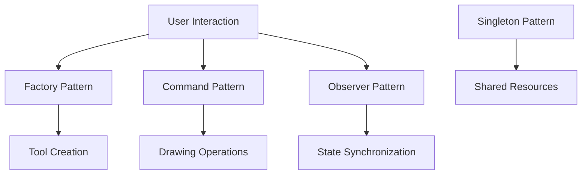
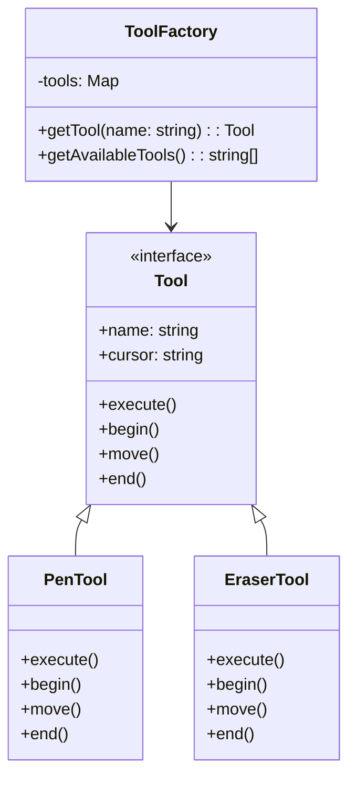
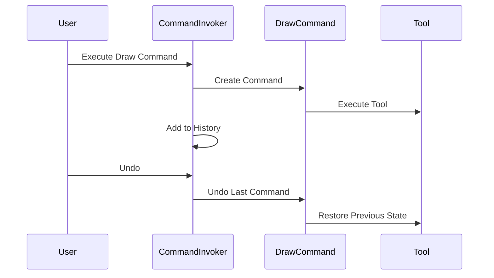
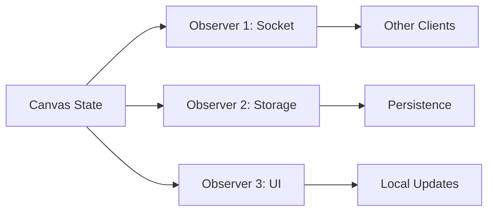
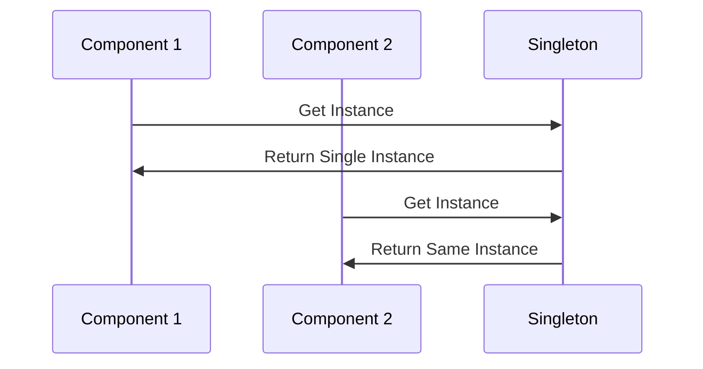
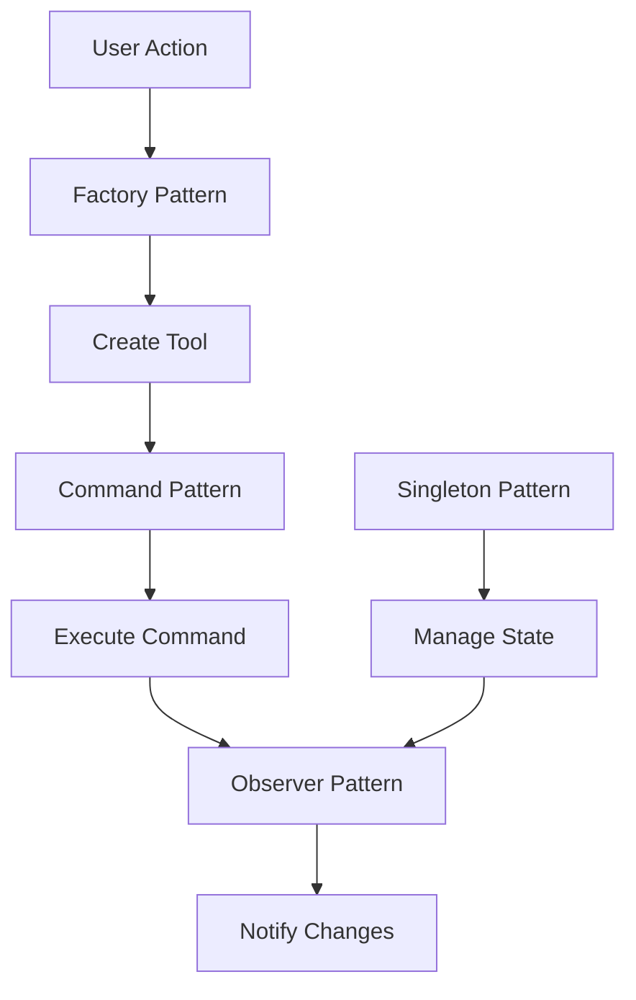

# Design Patterns Documentation

This document details the design patterns used in the Collaborative Whiteboard application and explains how they contribute to the application's architecture.

## Visual Overview



## Table of Contents
1. [Factory Pattern](#factory-pattern)
2. [Command Pattern](#command-pattern)
3. [Observer Pattern](#observer-pattern)
4. [Singleton Pattern](#singleton-pattern)

## Factory Pattern

### Visual Representation


Located in `src/lib/patterns/tools.ts`, the Factory Pattern is used to create different drawing tools.

### Implementation

```typescript
export interface Tool {
    name: string;
    cursor: string;
    execute(context: CanvasRenderingContext2D, x: number, y: number, options: DrawOptions): void;
    begin(context: CanvasRenderingContext2D, x: number, y: number, options: DrawOptions): void;
    move(context: CanvasRenderingContext2D, x: number, y: number, options: DrawOptions): void;
    end(context: CanvasRenderingContext2D): void;
}

export class ToolFactory {
    private static tools: Map<string, Tool> = new Map([
        ['pen', new PenTool()],
        ['eraser', new EraserTool()]
    ]);

    static getTool(name: string): Tool {
        const tool = this.tools.get(name);
        if (!tool) throw new Error(`Tool ${name} not found`);
        return tool;
    }
}
```

### Benefits
- Encapsulates tool creation logic
- Makes adding new tools easy
- Provides a consistent interface for all tools
- Reduces code duplication
- Improves maintainability

## Command Pattern

### Visual Representation


Located in `src/lib/patterns/commands.ts`, the Command Pattern is used to implement drawing operations and undo/redo functionality.

### Implementation

```typescript
export interface Command {
    execute(): void;
    undo(): void;
}

export class DrawCommand implements Command {
    constructor(
        private context: CanvasRenderingContext2D,
        private tool: Tool,
        private x: number,
        private y: number,
        private options: DrawOptions,
        private imageData?: ImageData
    ) {
        if (!this.imageData && context) {
            this.imageData = context.getImageData(0, 0, context.canvas.width, context.canvas.height);
        }
    }

    execute(): void {
        this.tool.execute(this.context, this.x, this.y, this.options);
    }

    undo(): void {
        if (this.imageData) {
            this.context.putImageData(this.imageData, 0, 0);
        }
    }
}
```

### Benefits
- Enables undo/redo functionality
- Encapsulates drawing operations
- Makes it easy to add new commands
- Maintains drawing history
- Supports command queuing

## Observer Pattern

### Visual Representation


Located in `src/lib/patterns/canvasState.ts`, the Observer Pattern is used to manage canvas state synchronization.

### Implementation

```typescript
export interface CanvasObserver {
    update(state: string): void;
}

export class CanvasStateManager {
    private observers: Set<CanvasObserver> = new Set();
    private currentState: string = '';

    addObserver(observer: CanvasObserver): void {
        this.observers.add(observer);
    }

    notifyObservers(): void {
        this.observers.forEach(observer => observer.update(this.currentState));
    }

    saveState(canvas: HTMLCanvasElement): void {
        this.currentState = canvas.toDataURL('image/png');
        this.notifyObservers();
    }
}
```

### Benefits
- Real-time state synchronization
- Decoupled state management
- Easy to add new observers
- Automatic state propagation
- Consistent state across clients

## Singleton Pattern

### Visual Representation


Used in various parts of the application to ensure single instances of critical components.

### Implementation

```typescript
export class CanvasStateManager {
    private static instance: CanvasStateManager;
    
    private constructor() {}
    
    static getInstance(): CanvasStateManager {
        if (!CanvasStateManager.instance) {
            CanvasStateManager.instance = new CanvasStateManager();
        }
        return CanvasStateManager.instance;
    }
}
```

### Benefits
- Single source of truth
- Shared state management
- Resource efficiency
- Consistent access point
- Prevents multiple instances

## Pattern Interactions

### Visual Flow


## Integration

These patterns work together to create a robust and maintainable application:

1. **Tool Creation Flow**:
   ```typescript
   const tool = ToolFactory.getTool('pen');
   tool.begin(context, x, y, options);
   ```

2. **Command Execution Flow**:
   ```typescript
   const command = new DrawCommand(context, tool, x, y, options);
   commandInvoker.execute(command);
   ```

3. **State Synchronization Flow**:
   ```typescript
   const stateManager = CanvasStateManager.getInstance();
   stateManager.saveState(canvas);
   // Automatically notifies all observers
   ```

## Best Practices

1. **Factory Pattern**:
   - Keep tool creation centralized
   - Use interfaces for consistency
   - Make tools easily extensible

2. **Command Pattern**:
   - Save state before execution
   - Keep commands atomic
   - Implement both execute and undo

3. **Observer Pattern**:
   - Keep observers loosely coupled
   - Use typed events
   - Clean up observers properly

4. **Singleton Pattern**:
   - Use private constructors
   - Implement lazy initialization
   - Consider thread safety

## Adding New Features

### Adding a New Tool
1. Create new tool class implementing `Tool` interface
2. Add tool to `ToolFactory.tools` map
3. Update tool selection UI

### Adding a New Command
1. Create new command class implementing `Command` interface
2. Implement execute and undo methods
3. Add to command invoker

### Adding a New Observer
1. Create new observer implementing `CanvasObserver` interface
2. Add observer to state manager
3. Handle cleanup properly

## Testing

Each pattern has its own testing strategy:

1. **Factory Pattern**:
   - Test tool creation
   - Test invalid tool handling
   - Test tool interface compliance

2. **Command Pattern**:
   - Test command execution
   - Test undo/redo
   - Test state preservation

3. **Observer Pattern**:
   - Test observer registration
   - Test notification flow
   - Test state updates

4. **Singleton Pattern**:
   - Test instance uniqueness
   - Test state persistence
   - Test thread safety 