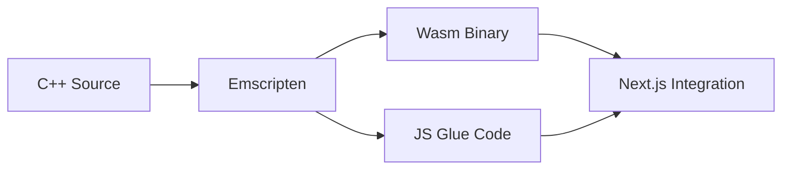
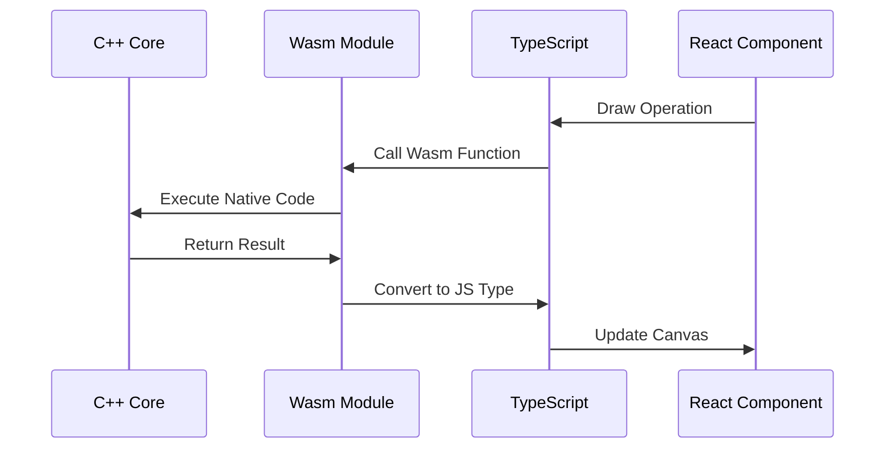

# WebAssembly Integration with Next.js

This document explains how WebAssembly (Wasm) is integrated into our Next.js application for high-performance drawing operations.

## Table of Contents
1. [Architecture Overview](#architecture-overview)
2. [Build Process](#build-process)
3. [Integration Flow](#integration-flow)
4. [Performance Benefits](#performance-benefits)
5. [Implementation Details](#implementation-details)

## Architecture Overview

```
┌─────────────────┐     ┌─────────────────┐     ┌─────────────────┐
│     C++ Core    │     │   Wasm Module   │     │    TypeScript   │
│  Drawing Logic  │ ──► │  Compiled Code  │ ──► │    Wrapper      │
└─────────────────┘     └─────────────────┘     └─────────────────┘
         ▲                                              ▲
         │                                              │
         └──────────��───── Emscripten ─────────────────┘
                       Compilation & Binding
```

## Build Process

1. **C++ to Wasm Compilation**:


2. **File Structure**:
```
wasm/
├── src/
│   ├── drawing.cpp        # Core drawing algorithms
│   ├── drawing.hpp        # C++ headers
│   └── bindings.cpp       # Emscripten bindings
├── build/
│   ├── drawing.wasm       # Compiled Wasm binary
│   └── drawing.js         # Generated JS interface
└── CMakeLists.txt        # Build configuration
```

## Integration Flow



## Performance Benefits

### Memory Management
```cpp
// C++ efficient memory handling
class DrawingBuffer {
    private:
        std::vector<Point> points;
        size_t capacity;

    public:
        void addPoint(float x, float y) {
            if (points.size() < capacity) {
                points.emplace_back(x, y);
            }
        }
};
```

### SIMD Operations
```cpp
// Using SIMD for parallel processing
#include <emmintrin.h>

void processPoints(float* points, int count) {
    __m128 multiplier = _mm_set1_ps(2.0f);
    for (int i = 0; i < count; i += 4) {
        __m128 data = _mm_load_ps(&points[i]);
        __m128 result = _mm_mul_ps(data, multiplier);
        _mm_store_ps(&points[i], result);
    }
}
```

## Implementation Details

### 1. C++ Core Implementation
```cpp
// drawing.hpp
class DrawingEngine {
public:
    void beginPath(float x, float y);
    void lineTo(float x, float y);
    void quadraticCurveTo(float cx, float cy, float x, float y);
    std::vector<Point> getPoints() const;
};
```

### 2. Emscripten Bindings
```cpp
// bindings.cpp
EMSCRIPTEN_BINDINGS(drawing_module) {
    class_<DrawingEngine>("DrawingEngine")
        .constructor<>()
        .function("beginPath", &DrawingEngine::beginPath)
        .function("lineTo", &DrawingEngine::lineTo)
        .function("getPoints", &DrawingEngine::getPoints);
}
```

### 3. TypeScript Wrapper
```typescript
// drawing.ts
class DrawingWrapper {
    private wasmInstance: DrawingEngine;

    constructor() {
        this.wasmInstance = new Module.DrawingEngine();
    }

    beginPath(x: number, y: number): void {
        this.wasmInstance.beginPath(x, y);
    }
}
```

### 4. React Integration
```typescript
// Whiteboard.tsx
const Whiteboard: React.FC = () => {
    const drawingEngine = useRef<DrawingWrapper>();

    useEffect(() => {
        // Initialize Wasm module
        initWasmModule().then((module) => {
            drawingEngine.current = new DrawingWrapper(module);
        });
    }, []);

    // Drawing handlers
};
```

## Build Configuration

### CMake Setup
```cmake
# CMakeLists.txt
cmake_minimum_required(VERSION 3.10)
project(drawing_wasm)

set(CMAKE_CXX_STANDARD 17)
set(CMAKE_CXX_STANDARD_REQUIRED ON)

# Emscripten settings
set(CMAKE_EXECUTABLE_SUFFIX ".js")
set(CMAKE_CXX_FLAGS "${CMAKE_CXX_FLAGS} -s WASM=1 -s USE_SDL=2")

add_executable(drawing
    src/drawing.cpp
    src/bindings.cpp
)
```

### Next.js Configuration
```javascript
// next.config.js
module.exports = {
    webpack: (config, { isServer }) => {
        // Wasm loader configuration
        config.experiments = {
            asyncWebAssembly: true,
            layers: true,
        };

        config.module.rules.push({
            test: /\.wasm$/,
            type: 'webassembly/async',
        });

        return config;
    },
};
```

## Loading and Initialization

### Dynamic Loading
```typescript
async function loadWasmModule() {
    try {
        const module = await import('@/wasm/drawing.wasm');
        await module.initialize();
        return module;
    } catch (error) {
        console.error('Failed to load Wasm module:', error);
        throw error;
    }
}
```

### Module Initialization
```typescript
// Initialize in component
useEffect(() => {
    let mounted = true;

    async function init() {
        try {
            const module = await loadWasmModule();
            if (mounted) {
                // Initialize drawing engine
                const engine = new module.DrawingEngine();
                // Store reference
            }
        } catch (error) {
            console.error('Initialization failed:', error);
        }
    }

    init();

    return () => {
        mounted = false;
    };
}, []);
```

## Performance Monitoring

### Metrics Collection
```typescript
interface PerformanceMetrics {
    drawTime: number;
    memoryUsage: number;
    frameRate: number;
}

function collectMetrics(): PerformanceMetrics {
    const metrics = {
        drawTime: performance.now(),
        memoryUsage: performance.memory?.usedJSHeapSize || 0,
        frameRate: calculateFrameRate()
    };
    return metrics;
}
```

### Optimization Tips

1. **Memory Management**:
   - Use typed arrays for data transfer
   - Minimize copying between JS and Wasm
   - Implement proper cleanup

2. **Threading**:
   - Use Web Workers for heavy computations
   - Implement thread pooling
   - Handle thread synchronization

3. **Data Transfer**:
   - Use shared memory when possible
   - Batch operations for efficiency
   - Minimize serialization/deserialization

## Testing

### Unit Testing
```cpp
// test_drawing.cpp
TEST_CASE("Drawing Engine Tests") {
    DrawingEngine engine;
    
    SECTION("Path Creation") {
        engine.beginPath(0, 0);
        auto points = engine.getPoints();
        REQUIRE(points.size() == 1);
    }
}
```

### Integration Testing
```typescript
describe('Wasm Integration', () => {
    let module: any;

    beforeAll(async () => {
        module = await loadWasmModule();
    });

    it('should initialize drawing engine', () => {
        const engine = new module.DrawingEngine();
        expect(engine).toBeDefined();
    });
});
``` 